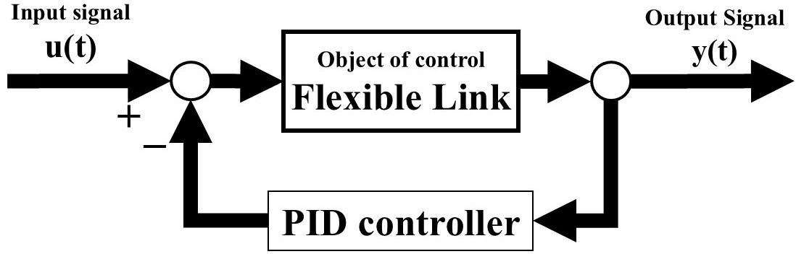
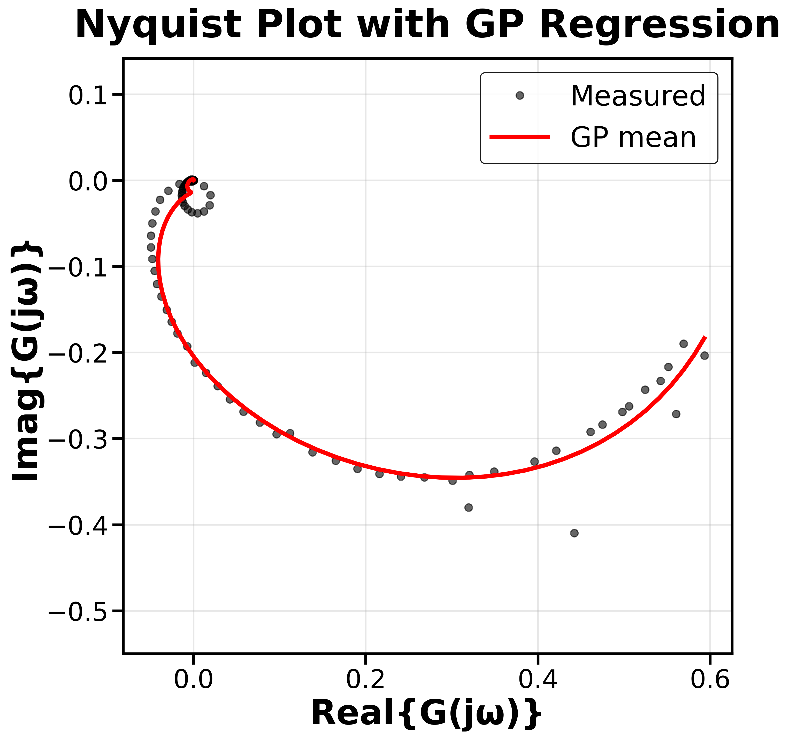
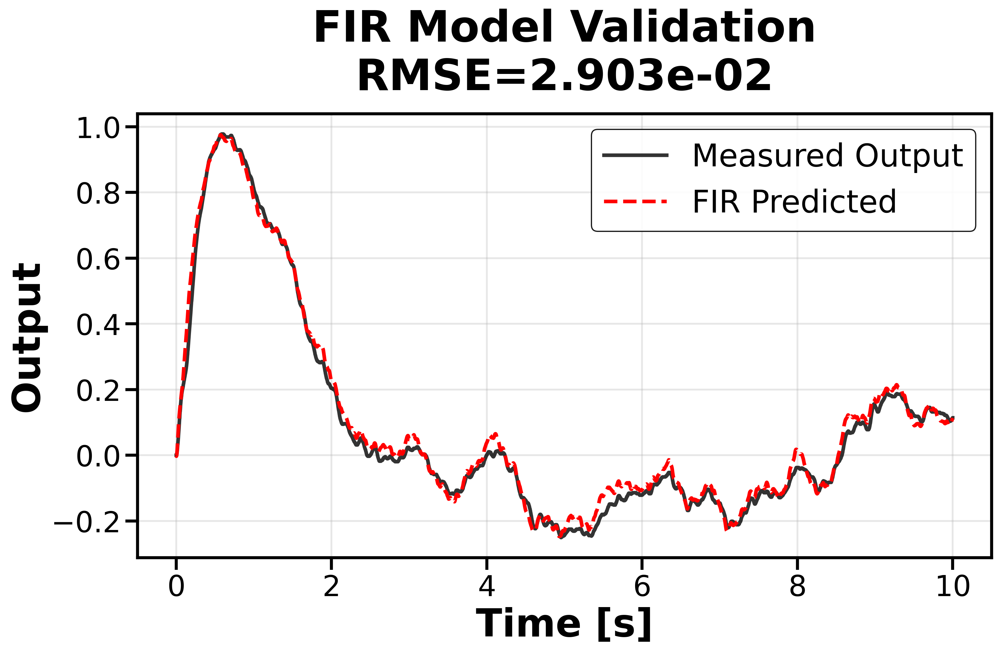
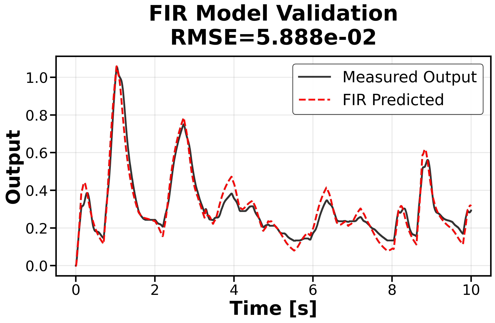

# System Identification via Frequency-Domain Gaussian Process Regression

<p align="center">
  
</p>

<p align="center">
  <em>Quanser Rotary Flexible Link — experimental apparatus used in this study</em>
</p>

> **Paper**: A. Yanagisawa and K. Ohki, "System Identification via Frequency-Domain Gaussian Process Regression for Transfer-Function Estimation," *SICE International Symposium on Control Systems (ISCS)*, 2026.
>
> **Authors**: Atsushi Yanagisawa, Kentaro Ohki — Kyoto University

[日本語版 README](docs/ja/README.md) &nbsp;|&nbsp; [Developer docs (src/)](src/README.md)

---

## Overview

### Why System Identification?

Control design requires a **high-precision mathematical model** of the plant. Real hardware differs from simulation — accurate models demand **large amounts of measured data**. **System identification** constructs these models directly from input–output data.

### The Challenge

The hurdles stand in the way of practical system identification:

**Model structure selection** — Parametric methods require choosing a model structure in advance, which is **difficult** even for linear time-invariant systems. Nonparametric methods (e.g., kernel-based FIR estimation) avoid this choice, but standard approaches lack uncertainty information.


### Why GPR?

**Gaussian Process Regression (GPR)** addresses the challenges at once:
- Smooth interpolation with **uncertainty quantification** (±2σ confidence bands)
- **No parametric model** structure required

**However**, GPR has a critical computational barrier: **O(n³) complexity** for n training points. For time-domain system identification with n ~ 10⁴–10⁵ samples, this is prohibitive.

### Our Solution — Frequency-Domain Compression

The **Fourier transform** compresses extensive time-series data into a compact set of ~100 FRF samples, while **fully preserving the system dynamics**. This reduces GPR's cost from O(n³) to **O(N_d³)**, making it tractable.

### Key Contributions

1. **Frequency-domain GPR framework** — enables practical GPR-based system identification even for long-duration observation data by operating on ~100 FRF samples instead of 10⁴–10⁵ time-domain points

2. **Real-hardware validation** — experimentally validated on a **Quanser Rotary Flexible Link**, demonstrating applicability beyond simulation

3. **Comprehensive kernel comparison** — compared **11 kernel functions** plus conventional methods (LS / NLS), identifying **Matérn-5/2** as the best GPR kernel

---

## Method Pipeline

```
┌─────────────────┐      ┌─────────────────┐      ┌─────────────────┐      ┌─────────────────┐
│  Step 1: FRF    │      │  Step 2: GPR    │      │  Step 3: FIR    │      │    Evaluate     │
│  Estimation     │─────▶│  Interpolation  │─────▶│  Reconstruction │─────▶│    (RMSE)       │
│                 │      │                 │      │                 │      │                 │
│  u(t),y(t) →   │      │  Continuous G   │      │  IDFT → h_k     │      │  ŷ(t) vs y(t)  │
│  Ĝ(jω_k)       │      │  with ±2σ bands │      │  FIR convolution│      │                 │
└─────────────────┘      └─────────────────┘      └─────────────────┘      └─────────────────┘
    ~10⁵ samples              ~100 points             FIR coefficients          Time-domain
    → ~100 FRF pts            O(N_d³) tractable       via Hermitian IDFT        validation
```

1. **FRF Estimation** — Estimate discrete $\hat{G}(j\omega_k)$ from input–output time-series data
2. **GPR Interpolation** — Apply GPR to interpolate a continuous FRF with **uncertainty quantification**
3. **FIR Reconstruction** — Reconstruct a FIR model via inverse Fourier transform and evaluate on time-series data

<p align="center">
  
</p>
<p align="center"><em>Closed-loop feedback control system (P-controller, K_p = 1.65)</em></p>

---

## Results

### Baseline Results (N_d = 50, T = 1 hour)

| Method | Multisine (×10⁻² rad) | Square Wave (×10⁻² rad) |
|:---|:---:|:---:|
| **GPR Kernels** | | |
| DC | 7.54 | 15.8 |
| DI | 6.92 | 15.1 |
| Exponential | 16.7 | 36.2 |
| Matérn-1/2 | 3.01 | 5.97 |
| Matérn-3/2 | 2.94 | 6.04 |
| **Matérn-5/2** | **2.90** | **5.89** |
| RBF | 3.05 | 5.96 |
| SS1 (Stable Spline 1st) | 3.01 | 5.97 |
| SS2 (Stable Spline 2nd) | 5.59 | 8.22 |
| SSHF (High-Freq Spline) | 3.44 | 6.31 |
| Stable Spline | 6.05 | 9.93 |
| **Classical Methods** | | |
| LS (Least Squares) | 9.79 | 26.9 |
| NLS (Nonlinear LS) | **2.75** | **5.77** |

> **Matérn-5/2** achieves the best GPR accuracy (RMSE = 0.0290), closely matching NLS (0.0275) — **without** specifying a parametric model structure. NLS relies on a **physically-derived** model structure (rational function with numerator degree 2, denominator degree 4), yet GPR achieves comparable accuracy with **no prior structural knowledge**.

### GPR Interpolation & FIR Validation

<table>
<tr>
<td align="center" width="33%">
<br>
<em>GPR interpolation on Nyquist plot<br>(Matérn-5/2, N_d = 50)</em>
</td>
<td align="center" width="33%">
<br>
<em>Multisine input validation<br>(RMSE = 0.0290)</em>
</td>
<td align="center" width="33%">
<br>
<em>Square-wave input validation<br>(RMSE = 0.0589)</em>
</td>
</tr>
</table>

The FIR model reconstructed from GPR accurately tracks both the **training signal** (multisine) and a completely **different validation signal** (square wave).

### Effect of Frequency Points N_d (T = 60 min)

| Method | N_d = 10 | N_d = 30 | N_d = 50 | N_d = 100 |
|:---|:---:|:---:|:---:|:---:|
| DI | **7.93** | **9.92** | 6.92 | 6.75 |
| Matérn-3/2 | 8.57 | 18.1 | 2.94 | 4.29 |
| Matérn-5/2 | 9.79 | 18.0 | **2.90** | 2.46 |
| RBF | 9.16 | 18.0 | 3.05 | 2.47 |
| SS1 | 9.13 | 22.4 | 3.01 | **2.45** |
| SSHF | 11.1 | 24.3 | 3.44 | 2.73 |
| NLS | 9.40 | 14.5 | **2.75** | **2.35** |

<sub>RMSE × 10⁻² [rad] (multisine input). **Bold** = best in column.</sub>

- **Sparse data (N_d ≤ 30)**: **DI kernel** excels — diagonal structure avoids over-extrapolation between distant frequency points
- **Dense data (N_d ≥ 50)**: **Matérn-5/2** best among GPR kernels; its C² sample paths match the smoothness of physical FRFs

### Effect of Observation Duration T (N_d = 50)

| Method | 10 min | 30 min | 60 min | 600 min |
|:---|:---:|:---:|:---:|:---:|
| DI | 6.87 | 6.93 | 6.92 | 7.03 |
| Matérn-3/2 | 3.23 | 2.98 | 2.94 | 3.98 |
| Matérn-5/2 | 4.12 | **3.00** | **2.90** | 3.78 |
| RBF | **3.05** | 3.02 | 3.05 | **3.03** |
| SS1 | **3.00** | 3.01 | 3.01 | 3.04 |
| SSHF | 3.40 | 3.43 | 3.44 | 3.43 |
| NLS | **2.74** | **2.90** | **2.75** | **2.90** |

<sub>RMSE × 10⁻² [rad] (multisine input). **Bold** = best in column.</sub>

- **RBF**: smoothing effect suppresses high-frequency noise — stable with short data
- **SS1**: stability prior enforces exponential decay — robust across durations
- **Matérn-5/2**: achieves best accuracy with 30–60 min of data, but more sensitive to duration

### Estimated FRF (Nyquist Plot)

<p align="center">
  
</p>
<p align="center"><em>Estimated FRF on the Nyquist plane (N_d = 100, T = 1 hour)</em></p>

### Summary

| | Finding |
|:---|:---|
| **Problem** | GPR's O(n³) complexity prevents direct use in system ID with large time-domain datasets |
| **Approach** | Frequency-domain compression: ~10⁵ time samples → ~100 FRF points, making GPR **tractable** |
| **Best kernel** | **Matérn-5/2** achieves best GPR accuracy (RMSE = 0.0290), closely matching NLS (0.0275) |
| **Key advantage** | GPR provides uncertainty quantification **without** specifying a parametric model |
| **Robustness** | RBF and SS1 maintain stable accuracy even with only 10-minute observations |

> **Take-Home Message**: Frequency-domain GPR **bridges** built-in uncertainty quantification with practical, scalable system identification.

---

## Method Details

### Step 1: FRF Estimation

From time-domain input-output data, we estimate the frequency response at logarithmically-spaced frequencies:

**Log-spaced frequency grid**:

$$f_k = 10^{\log_{10}(f_{\min}) + k \cdot \Delta_f / N_d}, \quad k = 0, \ldots, N_d - 1$$

**Complex Fourier coefficient**:

$$C_x(\omega_k) = \frac{2}{T} \int_{t_0 + \tau_{\text{drop}}}^{t_1} \bigl(x(t) - \bar{x}\bigr) e^{-j\omega_k t} \, dt$$

**Discrete FRF estimate**:

$$\hat{G}(j\omega_k) = \frac{C_y(\omega_k)}{C_u(\omega_k)}$$

### Step 2: GPR Interpolation

Real and imaginary parts are modeled as **independent Gaussian processes**:

$$x_i = \log_{10}(\omega_i), \quad y_i \in \{\text{Re}\{\hat{G}\}, \; \text{Im}\{\hat{G}\}\}$$

**Predictive mean**:

$$\hat{m}(x_{*}) = \boldsymbol{k}(x_{*})^\top \bigl(\boldsymbol{K} + \sigma_n^2 \boldsymbol{I}\bigr)^{-1} \boldsymbol{y}$$

Hyperparameters are optimized via **grid search** on validation FRF data (N_val = 150 independent points).

### Step 3: FIR Reconstruction

```
GP prediction → Uniform grid interpolation → Hermitian extension → IDFT → FIR coefficients
```

**Impulse response via IDFT**:

$$h_k = \text{Re}\!\left(\frac{1}{M} \sum_{n=0}^{M-1} X_n \exp\!\left(\frac{j 2\pi k n}{M}\right)\right)$$

where Hermitian symmetry ensures a real impulse response: $X_{M-n} = X_n^*$, $M = 2N_d - 1$

**FIR prediction (convolution)**:

$$\hat{y}(t) = \sum_{k=0}^{N-1} h_k \, u(t - k\Delta t), \quad N = \min(M, 1024)$$

### Kernel Functions (11 Tested)

| # | Kernel | Expression | Character |
|:---:|:---|:---|:---|
| 1 | **RBF** | k = σ²_f exp(−(x−x')² / 2ℓ²) | Infinitely smooth (C∞) |
| 2 | **Matérn-1/2** | k = σ²_f exp(−\|x−x'\| / ℓ) | Rough (C⁰) |
| 3 | **Matérn-3/2** | k = σ²_f (1 + √3d/ℓ) exp(−√3d/ℓ) | Once differentiable (C¹) |
| 4 | **Matérn-5/2** | k = σ²_f (1 + √5d/ℓ + 5d²/3ℓ²) exp(−√5d/ℓ) | Twice differentiable (C²) |
| 5 | **Exponential** | k = σ²_f H(x)H(x') exp(−ω(x+x')) | Stability prior |
| 6 | **DC** | k = β α^((x+x')/2) ρ^(\|x−x'\|) | Diagonal correlated |
| 7 | **DI** | k = β α^x if x=x'; 0 otherwise | Sparse-data specialist |
| 8 | **SS1** | k = σ²_f exp(−β min(x,x')) | 1st-order stable spline |
| 9 | **SS2** | k = σ²_f [½ exp(−β(x+x'+max)) − ⅙ exp(−3β·max)] | 2nd-order stable spline |
| 10 | **SSHF** | k = σ²_f (−1)^(x+x') max(exp(−βx), exp(−βx')) | High-frequency spline |
| 11 | **Stable Spline** | k = σ²_f · ½r²(R − r/3) | System-theoretic prior |

**Why Matérn-5/2 wins**: Its twice-differentiable (C²) sample paths match the smoothness of typical physical frequency responses. RBF (C∞) can show **logarithmic convergence** unless the target is analytic, while Matérn-5/2's finite smoothness better represents real-world dynamics.

### Comparison Methods

Both baselines model the FRF as a rational function $G(j\omega) = \frac{\sum_{i=0}^{n_b}\beta_i(j\omega)^i}{\sum_{j=0}^{n_a}\alpha_j(j\omega)^j}$ with $n_b = 2$, $n_a = 4$:

- **LS (Least Squares)** — Levy's linearized method; computationally efficient but biased toward high frequencies
- **NLS (Nonlinear LS)** — Direct output-error minimization; scale-invariant but may converge to local optima

---

## Experimental Setup

| Parameter | Value |
|:---|:---|
| **Plant** | Quanser Rotary Flexible Link |
| **Controller** | P-controller (K_p = 1.65) |
| **Sampling rate** | 500 Hz (Δt = 0.002 s) |
| **Frequency range** | [0.1, 250] Hz (log-spaced) |
| **Training signal** | Multisine |
| **Validation signal** | Random square wave |
| **Frequency points** | N_d ∈ {10, 30, 50, 100} |
| **Observation durations** | 10 min, 30 min, 60 min, 600 min |
| **Transient drop** | τ_drop = 0.02 s |
| **Hyperparameter search** | 30 log-spaced points in [10⁻³, 10³] per parameter |
| **Validation FRF** | N_val = 150 points (independent measurement session) |

**Multisine input signal**:

$$u(t) = \sum_{k=0}^{N_d - 1} a_k \sin(2\pi f_k t + \phi_k), \quad a_k \sim \mathcal{U}(0, 20/N_d), \quad \phi_k \sim \mathcal{U}(0, 2\pi)$$

### Limitations & Future Work

- Current validation is limited to **SISO** systems — **MIMO** and **nonlinear** systems not yet tested
- Independent Re/Im modeling prevents encoding **stability/causality** constraints
- Posterior uncertainty not yet exploited for **controller design**
- **Future**: Complex-valued GPR with Hardy-space RKHS for joint Re/Im modeling with stability constraints

---

## Software Features

- **14 GP kernels**: RBF, Matérn (1/2, 3/2, 5/2), Exponential, DC, DI, SS1, SS2, SSHF, Stable Spline, and combinations
- **Grid search optimization**: Automatic hyperparameter tuning with independent validation data
- **Robust methods**: ITGP (outlier-robust GP), T-distribution GP
- **FIR extraction**: Uniform grid + Hermitian symmetry + IDFT pipeline
- **Kernel-regularized FIR**: DC, SS2, SI kernels with marginal likelihood optimization
- **Classical methods**: NLS, LS, IWLS, TLS, ML estimators
- **ML methods**: Random Forest, Gradient Boosting, SVM regressors
- **Disk caching**: SHA-256 based cache for frequency-domain computations

---

## Project Structure

```
gauss_process/
├── main.py                  # Entry point (pipeline CLI)
├── requirements.txt         # Dependencies
├── src/                     # All source code
│   ├── run_baseline.py      # Reproduce baseline results (all 13 methods)
│   ├── gpr/                 # GP regression (14 kernels, grid search, ITGP)
│   ├── fir_model/           # FIR extraction, validation, LMS/RLS filters
│   ├── frequency_transform/ # FRF estimation (synchronous demodulation, FFT)
│   ├── classical_methods/   # NLS, LS, IWLS, TLS, ML, RF, GBR, SVM
│   ├── visualization/       # Publication-quality plot helpers
│   ├── utils/               # Hampel filter, data loaders
│   ├── pipeline/            # End-to-end pipeline and configuration
│   ├── examples/            # Example scripts
│   └── tests/               # Unit and integration tests
├── data/                    # Experimental data (.mat, .dat)
├── paper_figures/           # Figure generation scripts and outputs
├── docs/                    # Documentation and images
│   ├── images/              # Key figures for README
│   └── ja/                  # Japanese documentation
└── tex/                     # Paper and presentation LaTeX source
```

See [src/README.md](src/README.md) for detailed module documentation.

---

## Quick Start

### Installation

```bash
conda create --name GaussProcess python=3.11
conda activate GaussProcess
git clone https://github.com/AtsushiYanaigsawa768/gauss_process.git
cd gauss_process
pip install -r requirements.txt
```

### Running the Pipeline

```bash
# Full pipeline: frequency estimation + GP regression + FIR extraction
python main.py input/*.mat --kernel matern --nu 2.5 --normalize --log-frequency \
  --nd 50 --extract-fir --fir-length 1024 --out-dir output

# Use RBF kernel
python main.py input/*.mat --kernel rbf --extract-fir --out-dir output

# Use existing FRF data
python main.py --use-existing output/frf.csv --kernel matern --nu 2.5

# Show all options
python main.py --help
```

### Reproducing Baseline Results

```bash
# Run all 13 methods (11 GP kernels + LS/NLS) with standard settings
# (N_d=50, full observation data)
python -m src.run_baseline
```

Results are saved to `baseline_output/<timestamp>/`.

---

## References

- C.E. Rasmussen and C.K.I. Williams, *Gaussian Processes for Machine Learning*, MIT Press, 2006.
- R. Pintelon et al., "Parametric Identification of Transfer Functions in the Frequency Domain — A Survey," *IEEE Trans. Autom. Control*, 1994.
- L. Ljung, *System Identification: Theory for the User*, 2nd ed., Prentice Hall, 1999.
- G. Pillonetto and G. De Nicolao, "A New Kernel-Based Approach for Linear System Identification," *Automatica*, 2010.
- C.E. Rasmussen, "Gaussian Processes in Machine Learning," *LNCS*, vol. 3176, 2004.
- Y. Fujimoto, "Estimation of Impulse Response Using Kernel Regularization," 2020.
- J. Hensman et al., "Gaussian Processes for Big Data," *UAI*, 2013.
- H. Akaike, "A New Look at the Statistical Model Identification," *IEEE Trans. Autom. Control*, 1974.

---

<p align="center">
  <sub>Kyoto University — Department of Applied Mathematics and Physics / School of Informatics and Mathematical Science</sub>
</p>
