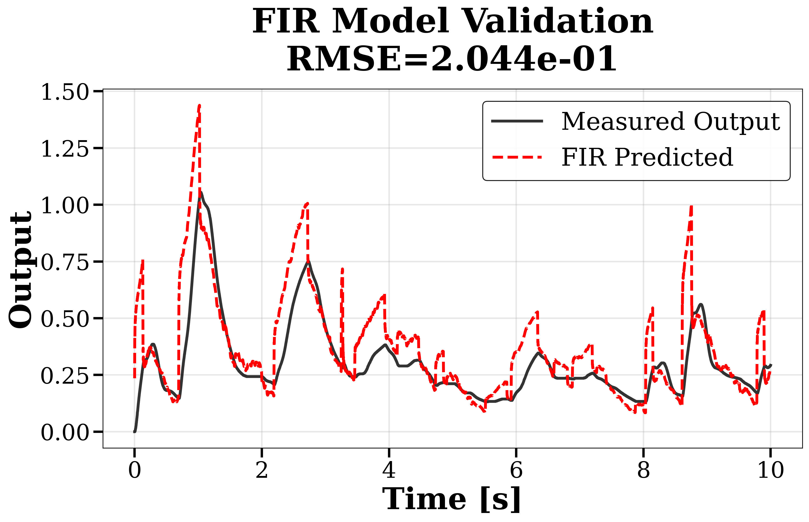
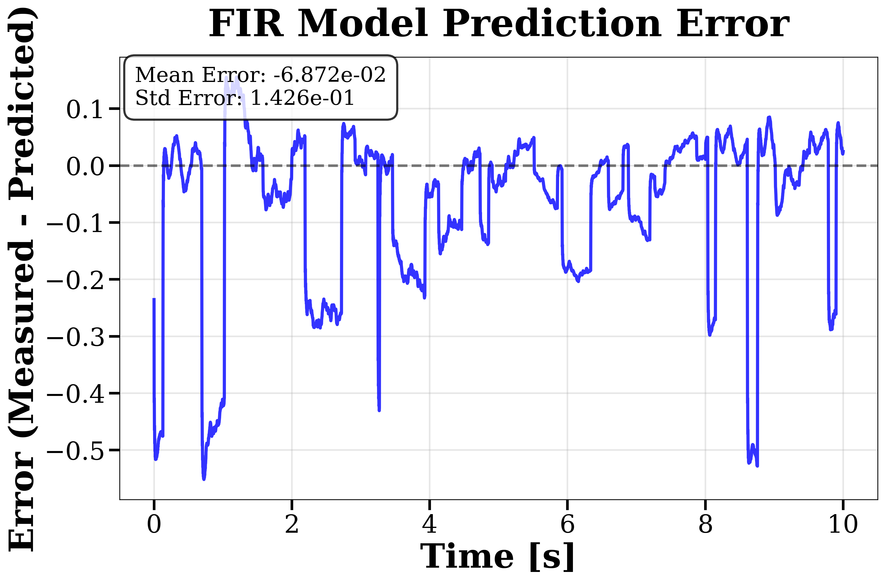

# fir_model/ -- FIR Model Identification

[日本語版はこちら](../../docs/ja/src/fir_model/README.md)

## Purpose

Converts GP-predicted frequency response functions into Finite Impulse Response
(FIR) filter coefficients and validates the resulting models against recorded
time-domain input/output data.

## Files

| File | Description |
|---|---|
| `fir_fitting.py` | Main GP-to-FIR pipeline: uniform omega grid, Hermitian-symmetric IDFT, time-domain validation |
| `fir_helpers.py` | Low-level DFT utilities: uniform omega grid construction, two-sided Hermitian extension, IDFT |
| `fir_validation.py` | Time-domain FIR validation: convolve FIR with input, compute RMSE/NRMSE/R2 |
| `fir_legacy.py` | Legacy IRFFT-based FIR extraction (preserved for backward compatibility) |
| `kernel_regularized.py` | Kernel-regularized FIR identification with DC, SS(2), and SI kernels via Tikhonov/GP regularization |
| `lms_filter.py` | LMS (Least Mean Squares) adaptive FIR identification |
| `rls_filter.py` | RLS (Recursive Least Squares) real-time FIR identification with live plotting |
| `partial_update_lms.py` | Partial-update LMS variant for reduced computation |

## GP-to-FIR Pipeline

The main pipeline (`fir_fitting.py`) performs:
1. Interpolate GP-predicted G(jw) onto a uniform omega grid
2. Build two-sided Hermitian-symmetric spectrum
3. Compute impulse response via IDFT
4. Validate by convolving FIR with recorded input u(t), comparing against y(t)

## Kernel-Regularized FIR

The `kernel_regularized.py` module implements time-domain FIR identification
using Tikhonov regularization with GP-motivated kernel matrices:

| Kernel | Description |
|---|---|
| DC | Diagonal Correlated -- exponential decay |
| SS | Second-order Stable Spline |
| SI | First-order Stable Spline (integrator-like) |

Hyperparameters are selected by maximizing the GP marginal likelihood.

## Usage

```bash
# Kernel-regularized FIR from CLI
python -m src.fir_model.kernel_regularized --io data/sample_data/input_test_20250913_010037.mat \
    --kernel dc --out output/

# LMS adaptive filter
python -m src.fir_model.lms_filter

# RLS real-time identification
python -m src.fir_model.rls_filter
```

## Metrics

All FIR validation routines report: RMSE, NRMSE, FIT (%), and R2.

## Results with Default Parameters

### Default Configuration

| Parameter | Value |
|:---|:---|
| FIR length | 1024 taps |
| Upstream GP kernel | Matern-5/2 |
| N_d (frequency points) | 50 |
| T (observation duration) | 1 hour |
| Sampling rate | 500 Hz (dt = 0.002 s) |
| Frequency range | [0.1, 250] Hz |
| Extraction mode | Paper mode (uniform omega + Hermitian IDFT) |

### Time-Domain Validation

<table>
<tr>
<td align="center" width="50%">
<br>
<em>Multisine input validation (RMSE = 0.0290)</em>
</td>
<td align="center" width="50%">
<br>
<em>Square-wave input validation (RMSE = 0.0589)</em>
</td>
</tr>
</table>

| Validation Signal | RMSE (x10^-2 rad) | Description |
|:---|:---:|:---|
| Multisine | 2.90 | Training signal type |
| Square wave | 5.89 | Unseen validation signal |

The FIR model reconstructed from GPR accurately tracks both the **training signal** (multisine) and a completely **different validation signal** (square wave), demonstrating generalization.

### FIR Prediction Detail

<table>
<tr>
<td align="center" width="50%">
<br>
<em>Actual output y(t) vs FIR prediction y_hat(t)</em>
</td>
<td align="center" width="50%">
<br>
<em>Prediction error e(t) = y(t) - y_hat(t)</em>
</td>
</tr>
</table>

The FIR convolution `y_hat(t) = sum(h_k * u(t - k*dt))` with 1024 taps captures the flexible link dynamics, including resonance behavior.
