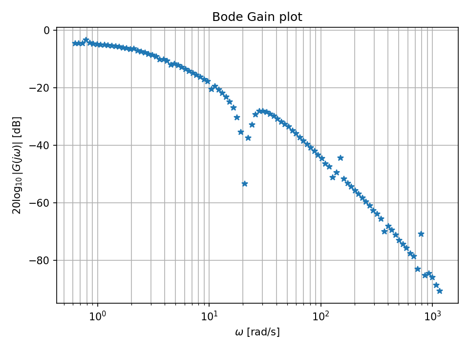
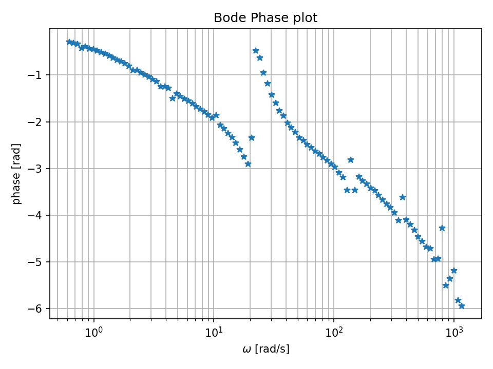
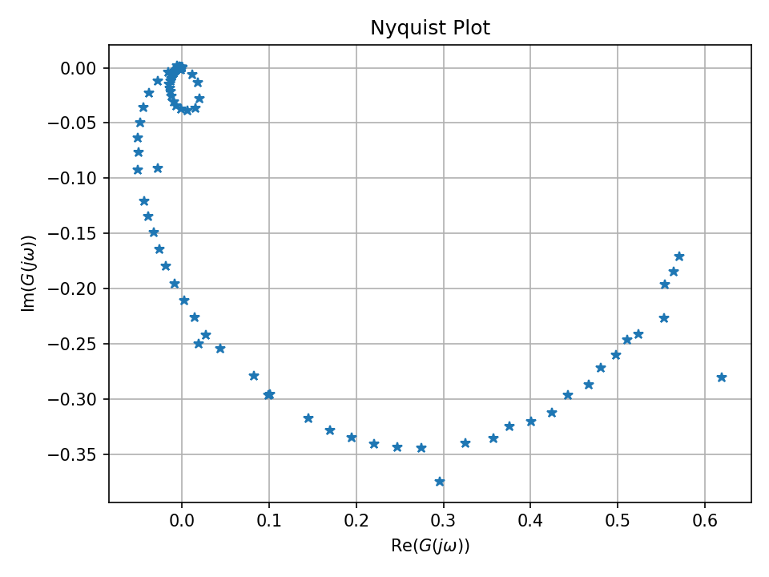
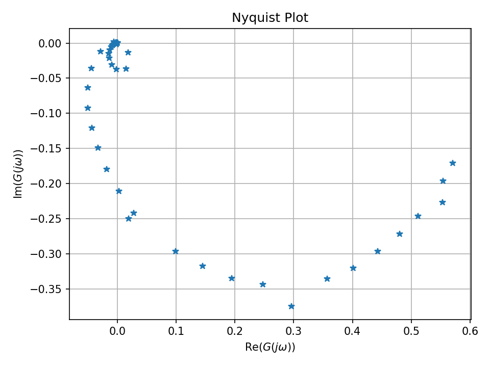

# frequency_transform/ -- Frequency Response Estimation

[日本語版はこちら](../../docs/ja/src/frequency_transform/README.md)

## Purpose

Estimates the Frequency Response Function (FRF) G(jw) from time-domain `.mat`
recordings using two methods, with optional disk-based caching.

## Files

| File | Description |
|---|---|
| `frf_estimator.py` | Synchronous demodulation on a logarithmic frequency grid (MATLAB-compatible) |
| `fourier_estimator.py` | FFT-based estimation on a linear frequency grid with windowing |
| `transform.py` | Unified interface -- dispatches to either estimator, optional caching |
| `cache.py` | `FrequencyDataCache` -- SHA-256 keyed disk cache storing DataFrames as CSV |

## Two Estimation Methods

| Feature | FRF (`frf`) | Fourier (`fourier`) |
|---|---|---|
| Frequency grid | Logarithmic (MATLAB-compatible) | Linear |
| Core algorithm | Trapezoidal synchronous demodulation | FFT with configurable window |
| Aggregation | Cross-power average G = sum(Y*conj(U)) / sum(\|U\|^2) | Complex mean of interpolated estimates |
| Non-uniform dt | Handled natively | Requires uniform sampling |

## Usage

```python
from src.frequency_transform.transform import estimate_frequency_response

# FRF method (default, log grid)
df = estimate_frequency_response(
    mat_files=["data/sample_data/*.mat"],
    method="frf", nd=100, n_files=3
)

# Fourier method (linear grid)
df = estimate_frequency_response(
    mat_files=["data/sample_data/*.mat"],
    method="fourier", nd=200, window="hann"
)

# With caching enabled
df = estimate_frequency_response(
    mat_files=["data/sample_data/*.mat"],
    method="frf", use_cache=True
)
```

## Output Format

Both methods return a `pandas.DataFrame` with columns:

| Column | Unit |
|---|---|
| `omega_rad_s` | rad/s |
| `freq_Hz` | Hz |
| `ReG`, `ImG` | -- |
| `absG` | -- |
| `phase_rad` | rad |

## Cache

Cache files are stored in `.cache/frequency_data/` by default. Each entry is
keyed by a truncated SHA-256 hash of the input configuration (file list,
frequency parameters, estimation method). Use `cache.invalidate()` to clear.

## Results with Default Parameters

### Default Configuration

| Parameter | Value |
|:---|:---|
| Method | frf (synchronous demodulation) |
| N_d (frequency points) | 50 (paper) / 100 (code default) |
| Frequency range | [0.1, 250] Hz (log10: [-1.0, 2.3]) |
| T (observation duration) | 1 hour |
| Sampling rate | 500 Hz |
| Transient drop | 0.02 s |

### FRF Estimation Output (T = 1 hour, N_d = 50)

<table>
<tr>
<td align="center" width="33%">
<br>
<em>Bode plot -- Magnitude</em>
</td>
<td align="center" width="33%">
<br>
<em>Bode plot -- Phase</em>
</td>
<td align="center" width="33%">
<br>
<em>Nyquist plot</em>
</td>
</tr>
</table>

FRF estimated via synchronous demodulation on a logarithmic frequency grid. The Nyquist plot clearly shows the resonance loop characteristic of the Quanser Rotary Flexible Link.

### Effect of Frequency Points N_d

<table>
<tr>
<td align="center" width="50%">
<br>
<em>Bode magnitude (N_d = 50)</em>
</td>
<td align="center" width="50%">
<br>
<em>Nyquist plot (N_d = 50)</em>
</td>
</tr>
</table>

- **N_d = 10--30**: Coarse resolution; suitable for low-order systems or when combined with DI kernel
- **N_d = 50**: Recommended baseline; balances resolution and GP computational cost
- **N_d = 100**: High resolution; reveals fine details of the FRF but increases GP complexity

### Estimated FRF (N_d = 100)

<p align="center">
<br>
<em>Estimated FRF on the Nyquist plane (N_d = 100, T = 1 hour)</em>
</p>
