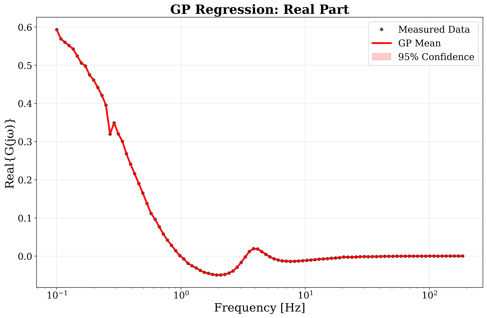
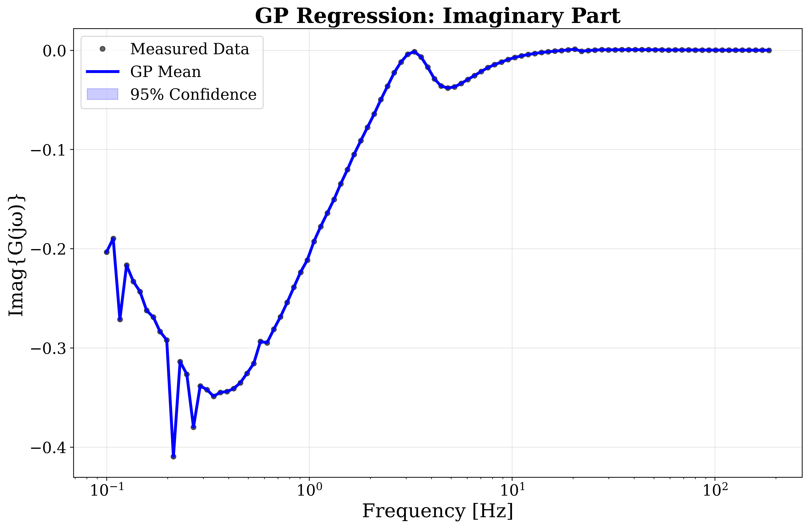
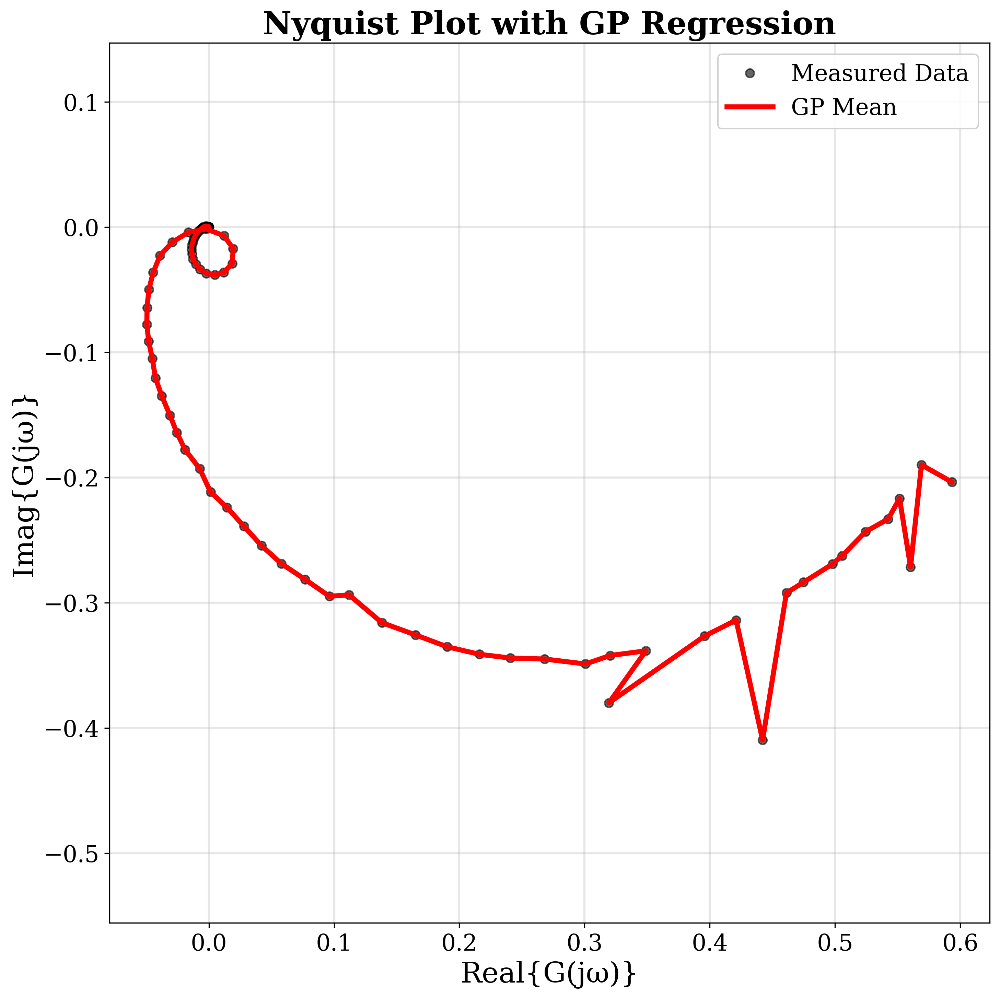

# gpr/ -- Gaussian Process Regression

[日本語版はこちら](../../docs/ja/src/gpr/README.md)

## Purpose

Fits smooth transfer function models to noisy frequency response data using
Gaussian Process regression, with multiple kernel choices, hyperparameter
optimization, and outlier-robust variants.

## Files

| File | Description |
|---|---|
| `kernels.py` | 14 kernels (RBF, Matern, RQ, Exponential, TC, DC, DI, SS1, SS2, HFSS, StableSpline, ...) + `create_kernel()` factory |
| `gpr_fitting.py` | `GaussianProcessRegressor` class with gradient-based and grid-search optimization |
| `grid_search.py` | Exhaustive and random hyperparameter search with cross-validation |
| `itgp.py` | Iteratively-Trimmed GP (ITGP) using `robustgp` library with Hampel outlier filtering |
| `t_distribution.py` | Student-t likelihood GP via GPflow VGP for heavy-tailed noise robustness |
| `linear_interpolation.py` | Linear interpolation baseline with Hampel-filtered evaluation |
| `visualization.py` | GP-specific plotting (Bode, Nyquist, predicted vs actual) |
| `pure_gp_kernels.py` | From-scratch kernel implementations (no sklearn dependency) |
| `pure_gp_fitting.py` | From-scratch GP fitting with manual marginal likelihood optimization |
| `knn_noise_filter.py` | k-NN based noise filtering for frequency response data |
| `least_squares.py` | Least-squares polynomial fitting for comparison |
| `descriptive_stats.py` | Summary statistics for frequency response datasets |

## Kernel Reference

The `create_kernel(name, **kwargs)` factory supports these names:

| Kernel | Key Parameters |
|---|---|
| `rbf` | `length_scale`, `variance` |
| `matern` | `length_scale`, `variance`, `nu` (0.5, 1.5, 2.5) |
| `rational_quadratic` | `length_scale`, `variance`, `alpha` |
| `exponential` | `length_scale`, `variance` |
| `tc`, `dc`, `di` | `variance`, `beta` (system identification kernels) |
| `ss1`, `ss2`, `hfss` | `variance`, `beta` (stable spline kernels) |

## Usage

```python
from src.gpr.kernels import create_kernel
from src.gpr.gpr_fitting import GaussianProcessRegressor

kernel = create_kernel("rbf", length_scale=1.0, variance=1.0)
gp = GaussianProcessRegressor(kernel=kernel, noise_variance=1e-6)
gp.fit(X_train, y_train, optimize=True, use_grid_search=True)
mean, var = gp.predict(X_test)
```

## ITGP (Outlier-Robust GP)

The ITGP method iteratively trims outlier data points and refits the GP:

```python
from src.gpr.itgp import run_itgp_pipeline
results = run_itgp_pipeline(data_dir="data/gp_training/")
```

## T-Distribution GP

Uses GPflow's Variational GP with Student-t likelihood for robustness to
heavy-tailed noise:

```python
from src.gpr.t_distribution import run_t_distribution_pipeline
results = run_t_distribution_pipeline(data_dir="data/gp_training/")
```

## Data Preprocessing

- Frequency inputs are log-transformed: `X = log10(omega)`
- Features are standardized with `sklearn.preprocessing.StandardScaler`
- GP modes: `separate` (fit Re/Im independently) or `polar` (fit log-magnitude/phase)

## Results with Default Parameters

### Default Configuration

| Parameter | Value |
|:---|:---|
| Kernel | Matern-5/2 |
| noise_variance | 1e-6 |
| optimize | True |
| normalize_inputs | True |
| log_frequency | True |
| gp_mode | separate (Re/Im independent) |
| N_d (frequency points) | 50 |
| T (observation duration) | 1 hour |
| Sampling rate | 500 Hz |
| Frequency range | [0.1, 250] Hz (log-spaced) |

### Kernel Comparison (N_d = 50, T = 1 hour)

| Method | Multisine RMSE (x10^-2 rad) | Square Wave RMSE (x10^-2 rad) |
|:---|:---:|:---:|
| **GPR Kernels** | | |
| DC | 7.54 | 15.8 |
| DI | 6.92 | 15.1 |
| Exponential | 16.7 | 36.2 |
| Matern-1/2 | 3.01 | 5.97 |
| Matern-3/2 | 2.94 | 6.04 |
| **Matern-5/2** | **2.90** | **5.89** |
| RBF | 3.05 | 5.96 |
| SS1 (Stable Spline 1st) | 3.01 | 5.97 |
| SS2 (Stable Spline 2nd) | 5.59 | 8.22 |
| SSHF (High-Freq Spline) | 3.44 | 6.31 |
| Stable Spline | 6.05 | 9.93 |
| **Classical Methods** | | |
| LS (Least Squares) | 9.79 | 26.9 |
| NLS (Nonlinear LS) | **2.75** | **5.77** |

**Matern-5/2** achieves the best GPR accuracy (RMSE = 0.0290), closely matching NLS (0.0275) -- **without** specifying a parametric model structure.

### GP Regression Output

<table>
<tr>
<td align="center" width="33%">
<br>
<em>GP prediction -- Real part of G(jw)</em>
</td>
<td align="center" width="33%">
<br>
<em>GP prediction -- Imaginary part of G(jw)</em>
</td>
<td align="center" width="33%">
<br>
<em>GP prediction on Nyquist plane</em>
</td>
</tr>
</table>

<p align="center">
<br>
<em>Matern-5/2 GPR interpolation with +/-2 sigma confidence bands (N_d = 50)</em>
</p>

### Effect of Frequency Points N_d (T = 60 min)

| Method | N_d = 10 | N_d = 30 | N_d = 50 | N_d = 100 |
|:---|:---:|:---:|:---:|:---:|
| DI | **7.93** | **9.92** | 6.92 | 6.75 |
| Matern-3/2 | 8.57 | 18.1 | 2.94 | 4.29 |
| Matern-5/2 | 9.79 | 18.0 | **2.90** | 2.46 |
| RBF | 9.16 | 18.0 | 3.05 | 2.47 |
| SS1 | 9.13 | 22.4 | 3.01 | **2.45** |
| SSHF | 11.1 | 24.3 | 3.44 | 2.73 |
| NLS | 9.40 | 14.5 | **2.75** | **2.35** |

<sub>RMSE x 10^-2 [rad] (multisine input). **Bold** = best in column.</sub>

- **Sparse data (N_d <= 30)**: **DI kernel** excels -- diagonal structure avoids over-extrapolation
- **Dense data (N_d >= 50)**: **Matern-5/2** best among GPR; C2 sample paths match physical FRF smoothness

### Effect of Observation Duration T (N_d = 50)

| Method | 10 min | 30 min | 60 min | 600 min |
|:---|:---:|:---:|:---:|:---:|
| DI | 6.87 | 6.93 | 6.92 | 7.03 |
| Matern-3/2 | 3.23 | 2.98 | 2.94 | 3.98 |
| Matern-5/2 | 4.12 | **3.00** | **2.90** | 3.78 |
| RBF | **3.05** | 3.02 | 3.05 | **3.03** |
| SS1 | **3.00** | 3.01 | 3.01 | 3.04 |
| SSHF | 3.40 | 3.43 | 3.44 | 3.43 |
| NLS | **2.74** | **2.90** | **2.75** | **2.90** |

<sub>RMSE x 10^-2 [rad] (multisine input). **Bold** = best in column.</sub>

- **RBF**: Smoothing effect suppresses high-frequency noise -- stable across durations
- **SS1**: Stability prior enforces exponential decay -- robust across durations
- **Matern-5/2**: Best accuracy at 30--60 min, but more sensitive to duration
